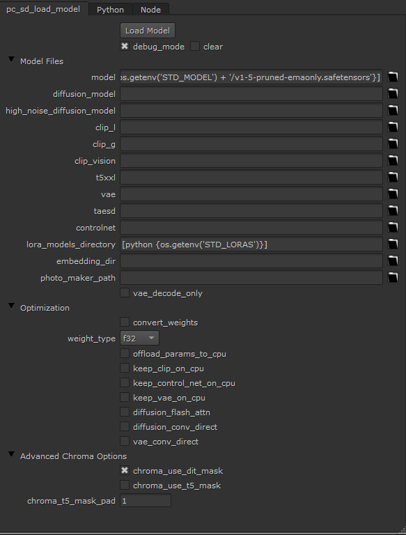
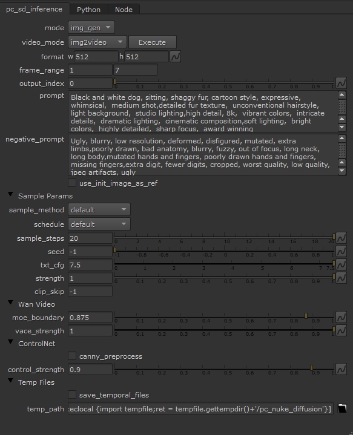
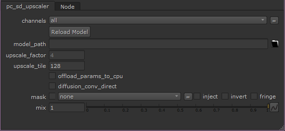

# pc_nuke_diffusion
The Foundry Nuke implementation of diffusion models in c++ thansk to  https://github.com/leejet/stable-diffusion.cpp

***🔥Note that this project, and [stable-diffusion.cpp](https://github.com/leejet/stable-diffusion.cpp) are under active development.***

- Supported models
  - Image Models
    - SD1.x, SD2.x, [SD-Turbo](https://huggingface.co/stabilityai/sd-turbo)
    - SDXL, [SDXL-Turbo](https://huggingface.co/stabilityai/sdxl-turbo)
    - [SD3/SD3.5](https://github.com/leejet/stable-diffusion.cpp/tree/master/docs/sd3.md)
    - [Flux-dev/Flux-schnell](https://github.com/leejet/stable-diffusion.cpp/tree/master/docs/flux.md)
    - [Chroma](https://github.com/leejet/stable-diffusion.cpp/tree/master/docs/chroma.md)
    - [Qwen Image](https://github.com/leejet/stable-diffusion.cpp/tree/master/docs/qwen_image.md)
  - Image Edit Models
    - [FLUX.1-Kontext-dev](https://github.com/leejet/stable-diffusion.cpp/tree/master/docs/kontext.md)
    - [Qwen Image Edit/Qwen Image Edit 2509](https://github.com/leejet/stable-diffusion.cpp/tree/master/docs/qwen_image_edit.md)
  - Video Models
    - [Wan2.1/Wan2.2](https://github.com/leejet/stable-diffusion.cpp/tree/master/docs/wan.md)
  - Control Net support with SD 1.5
  - LoRA support, same as [stable-diffusion-webui](https://github.com/AUTOMATIC1111/stable-diffusion-webui/wiki/Features#lora)
  - Latent Consistency Models support (LCM/LCM-LoRA)
  - Faster and memory efficient latent decoding with [TAESD](https://github.com/madebyollin/taesd)
  - Upscale images generated with [ESRGAN](https://github.com/xinntao/Real-ESRGAN)


There is also Support for some [Nvidia Maxine](https://docs.nvidia.com/deeplearning/maxine/vfx-sdk-system-guide/index.html) Filters:


---
## 🚀Current NUKE Nodes
- **pc_sd_load_model**  
To load the models, vaes, loras etc. Same parameters as the cl tool
<p align="center">
  
</p>

- **pc_sd_inference**   
This needs to be connected to a **pc_sd_load_model** to work, it will inference the loaded model, here you can set the prompt, scheduler, steps, etc. It accepts RGBA, if alpha it will be used for inpainting. There are inputs for control net image, and for reference images to be used with Flux kontext or Qween image edit.  
It can also generate video, more documentation soon.    
<p align="center">
  
</p>

- **pc_sd_upcaler**    
Here you can load and inference ESRGAN models to upscale images,[RealESRGAN_x4plus.pth](https://github.com/xinntao/Real-ESRGAN/releases/download/v0.1.0/RealESRGAN_x4plus.pth),  [RealESRGAN_x4plus_anime_6B.pth](https://github.com/xinntao/Real-ESRGAN/releases/download/v0.2.2.4/RealESRGAN_x4plus_anime_6B.pth), and ESRGAN are supported, you can grab community pretrained models from [openmodeldb](https://openmodeldb.info/?t=arch%3Aesrgan+arch%3Aesrgan%2B) like the [4x-LSDIRplus](https://openmodeldb.info/models/4x-LSDIRplus) wich gives more natural results for example. There are 1x, 2x and 4x models, and you can adjust tile_size, de default value should work on 4GB VRAM machines, increase it for faster iterations on good graphics cards.
<p align="center">
  
</p>

- **pc_sd_nvfx_videoeffects**    
This is the one for [Nvidia Maxine](https://docs.nvidia.com/deeplearning/maxine/vfx-sdk-system-guide/index.html). This will run in real time but dont apply this on resolutions avobe 1920x1080. It has 3 Supported modes:
    - **Encoder Artifact Reduction (Beta)**, which reduces the blocking and noisy artifacts that are produced from encoding while preserving the details of the original video. This works pretty well on low res downloaded videos.    
    The ArtifactReduction effect has the following modes:
        - Strength 0, which applies a weak effect.
        - Strength 1, which applies a strong effect.
        
    - **Super resolution (Beta)**, which upscales a video and reduces encoding artifacts. This filter enhances the details, sharpens the output, and preserves the content. The SuperRes effect has two modes:
        - Strength 1, which applies strong enhancements.
        - Strength 0, which applies weaker enhancements while reducing encoding artifacts.
        
    - **Upscale (Beta)**, which is a fast and light-weight method to upscale for an input video and sharpen the resulting output.
---
🔥Important
I highly recommend checking the [stable-diffusion.cpp documentation](https://github.com/leejet/stable-diffusion.cpp/tree/master/docs) as the nodes are a translation of what you can do there with the sd.exe command line tool. The nuke knobs are named the same as the cl arguments for easier reference.
- [SD1.x/SD2.x/SDXL](https://github.com/leejet/stable-diffusion.cpp/tree/master/docs/sd.md)
- [SD3/SD3.5](https://github.com/leejet/stable-diffusion.cpp/tree/master/docs/sd3.md)
- [Flux-dev/Flux-schnell](https://github.com/leejet/stable-diffusion.cpp/tree/master/docs/flux.md)
- [FLUX.1-Kontext-dev](https://github.com/leejet/stable-diffusion.cpp/tree/master/docs/kontext.md)
- [Chroma](https://github.com/leejet/stable-diffusion.cpp/tree/master/docs/chroma.md)
- [🔥Qwen Image](https://github.com/leejet/stable-diffusion.cpp/tree/master/docs/qwen_image.md)
- [🔥Qwen Image Edit/Qwen Image Edit 2509](https://github.com/leejet/stable-diffusion.cpp/tree/master/docs/qwen_image_edit.md)
- [🔥Wan2.1/Wan2.2](https://github.com/leejet/stable-diffusion.cpp/tree/master/docs/wan.md)
- [LoRA](https://github.com/leejet/stable-diffusion.cpp/tree/master/docs/lora.md)
- [LCM/LCM-LoRA](https://github.com/leejet/stable-diffusion.cpp/tree/master/docs/lcm.md)
- [Using ESRGAN to upscale results](https://github.com/leejet/stable-diffusion.cpp/tree/master/docs/esrgan.md)
- [Using TAESD to faster decoding](https://github.com/leejet/stable-diffusion.cpp/tree/master/docs/taesd.md)
---
---
# Building
In theory you can build it for Windows and Linux, but I only tested in windows, for linux build ( or non CUDA building ) check the [stable-diffusion.cpp](https://github.com/leejet/stable-diffusion.cpp) building guide. If you are going to build for non CUDA, dont build the **pc_sd_nvfx_videoeffects** node, the others should work.
## Get the Code

```
git clone --recursive https://github.com/pedroCabrera/pc_nuke_diffusion
cd pc_nuke_diffusion
```

- If you have already cloned the repository, you can use the following command to update the repository to the latest code.

```
cd pc_nuke_diffusion
git pull origin main
git submodule update --init --recursive
```

## Windows CUDA

There is a [build.bat](https://github.com/pedroCabrera/pc_nuke_diffusion/blob/5766000838354034b7ef8209a89c7916bdf3e5cc/build.bat) that will call the [build_deps.bat](https://github.com/pedroCabrera/pc_nuke_diffusion/blob/5766000838354034b7ef8209a89c7916bdf3e5cc/build_deps.bat) and then will build the plugin for each nuke version defined in [build.bat](https://github.com/pedroCabrera/pc_nuke_diffusion/blob/5766000838354034b7ef8209a89c7916bdf3e5cc/build.bat)
```sh
set "NUKE_14_1=C:/Program Files/Nuke14.1v1"
set "NUKE_15_1=C:/Program Files/Nuke15.1v8"
set "NUKE_15_2=C:/Program Files/Nuke15.2v4"
```
The [build_deps.bat](https://github.com/pedroCabrera/pc_nuke_diffusion/blob/5766000838354034b7ef8209a89c7916bdf3e5cc/build_deps.bat) script that will build [stable-diffusion.cpp](https://github.com/leejet/stable-diffusion.cpp) and [Nvidia Maxine](https://docs.nvidia.com/deeplearning/maxine/vfx-sdk-system-guide/index.html) packages.

### Requirements
You must download and install 

- [Nvidia CUDA Toolkit](https://developer.nvidia.com/cuda-downloads)
- [nvvfx for your graphics card](https://www.nvidia.com/es-es/geforce/broadcasting/broadcast-sdk/resources/)
- [CMAKE](https://cmake.org/)
- [GIT](https://git-scm.com/)
- [NUKE of course](https://www.foundry.com/products/nuke-family/nuke)

*I recomend downloading [CCACHE](https://github.com/ccache/ccache) and adding it to your system PATH so when recompiling it will be faster*
